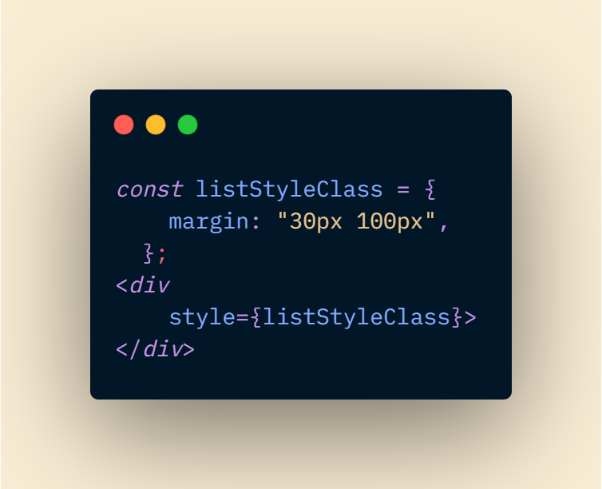
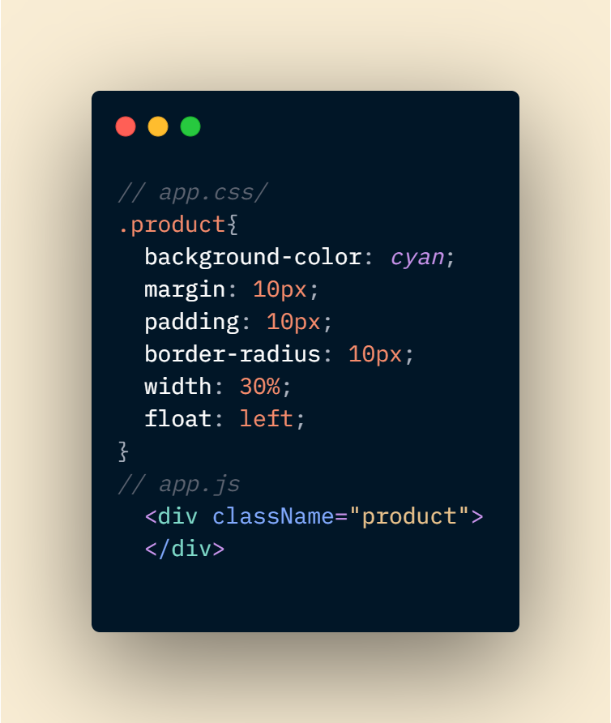

# React_Js
    * React is a JavaScript library for building user interfaces.
# Here are what I consider to be React prerequisites.
   * Basic familiarity with HTML & CSS.
   * Basic knowledge of JavaScript and programming.
   * Basic understanding of the DOM.
   * Familiarity with ES6 syntax and features.
   * Node.js and npm installed globally.
# todo: how to create/start react app. 
    - npx create-react-app my-app // create a new app and download required files
    - cd my-app // entering app directory
    - npm start // start app server.
# how react works
    - react works component based.
    - React creates a VIRTUAL DOM in memory.
    - Instead of manipulating the browser's DOM directly, 
    - React creates a virtual DOM in memory, 
    - where it does all the necessary manipulating, 
    - before making the changes in the browser DOM.
    - then changes only what needs to be changed

# react JSX
    *JSX stands for “JavaScript XML,” and it is a syntax extension to JavaScript based in ES6, the newest “version” of  JavaScript. JSX allows you to write HTML in React by converting HTML into React components, helping you to more easily create user interfaces for your web applications.
    * const element = <h1>Hello, world!</h1>;
    * It is called JSX, and it is a syntax extension to JavaScript. We recommend using it with React to describe what     the UI should look like. JSX may remind you of a template language, but it comes with the full power of JavaScript.

# react createElement 
    * React.CreateElement(type,props,children)
    * type - Type of the html element or component(Ex: h1,p,button...etc)
    * props - The properties object (Ex: {style:{color:'green'}} or className or event handlers etc.)
    * children - anything you need to pass between the dom elements.
    -- Example: React.createElement('h1', {style:{color:'green'}}, 'Hello World!')
    * react element is immutable. We should create a new element every time.
# React Render to Dom 
    * ReactDom.render(element, DOMNode) - It takes a React element and render it to a DOM node.
    * Example: ReactDom.render(<App/>, document.getElementById('root'));
    * app.js(c1,c2.....) --> index.js --> index.html.

# props 
    * we should not change props inside React components.
    * props means properties

# Fragment 
    * Fragment is used to group a list of children without adding extra nodes to the DOM.
    * when we need to return multiple children elements then we will use <React.Fragment>....</React.Fragment>

# Component
    * Component are the building blocks of any React app. 
    * Components let you split the UI into independent, reusable pieces, and think about each piece in isolation. 
    * Components are like JavaScript functions. They accept arbitrary inputs (called "props") and return React elements describing what should appear on the screen.
    * Always start components with a capital letter. 

# Functional Components
    * It is a JavaScript function which accepts a single "props" object argument with data and returns a React Element.
    * Syntax:- 
                function func_name(props){
                    return React Element;
                }
# Class Component 
    * A class component requires you to extend from React.Component. The class must implement a render() method function which returns a React component to be rendered, similar to a return value of a functional component. In a class-based component, props are accessible via this.props.
    ** Syntax:- 
                class class_name extends Component{
                    render() {
                        return React Element
                    }
                }
# Rendering a Component
    * ReactDom.render(<component/>, document.getElementById('root'));
    * ReactDom.render(<component name="name" />, document.getElementById('root')); //here name is properties. we access this using props.name.

# state and lifecycle
    * We can create state only in class component.
    * two way to initialize state - 
        1. directly inside class. 
        2. inside the constructor 
    * use setState() method and passing update object then that component will change the state. We should call this method under the componentDidMount() method.
# ComponentDidMount() & componentWillUnmount()
    * this is life cycle method of react. it runs after component has been rendered to the DOM
    * unmount the component and remove timer. 
# how to use style on component  
    * 3 ways to add CSS in the component
    * inline, internal, external
# inlineCss 
    * add style variable as an object and pass the css property as dynamic way as shown in the picture

# InternalCss
    * we should use CSS property like as an object
    * must use camel case

# ExternalCss
    * Write css class into app.css file
    * add the class into the component.
    * Must write className instead of class.

